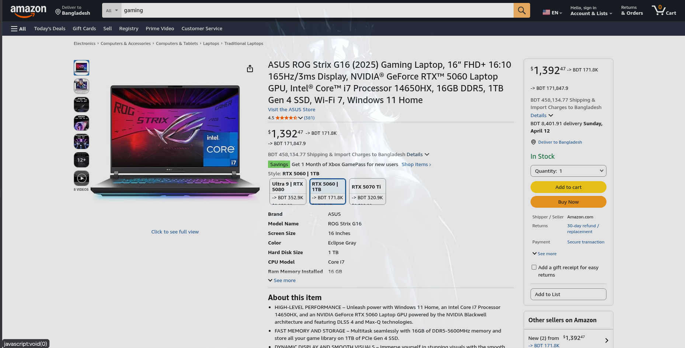
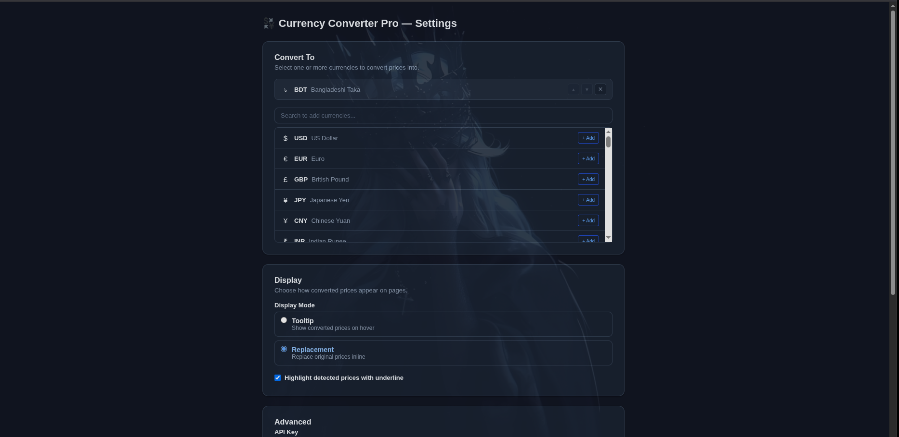

# 💱 RateSnap (Currency Converter Pro)

A Chrome extension that **automatically detects and converts prices** on any webpage to your preferred currencies using real-time exchange rates.


---





---

## Features

- **Auto-Detection** — Scans web pages for prices in 50+ currencies using smart regex and DOM traversal
- **Real-Time Rates** — Fetches live exchange rates from [Open Exchange Rates](https://openexchangerates.org/) with configurable refresh intervals
- **Multi-Currency** — Convert detected prices to multiple target currencies simultaneously
- **Two Display Modes**
  - **Tooltip** — Hover over any detected price to see conversions in a popup card
  - **Replacement** — Inline badges showing converted amounts next to the original price
- **Quick Convert** — Built-in calculator in the popup with searchable From/To currency selectors and a swap button
- **Smart Symbol Resolution** — Disambiguates `$` based on the website's domain (e.g., `.au` → AUD, `.ca` → CAD)
- **SPA Support** — MutationObserver watches for dynamically added content on single-page apps
- **Site Blacklist** — Disable the extension on specific domains
- **Dark Mode** — Tooltip and replacement styles adapt to dark backgrounds
- **Setup Wizard** — Guided 4-step setup on first install

---




## Supported Currencies

USD, EUR, GBP, JPY, CNY, INR, BDT, AUD, CAD, CHF, HKD, SGD, SEK, KRW, NOK, NZD, MXN, ZAR, BRL, TRY, RUB, PLN, THB, IDR, MYR, PHP, CZK, ILS, CLP, PKR, AED, SAR, TWD, ARS, EGP, VND, NGN, KES, QAR, UAH, COP, RON, PEN, HUF, DKK, BGN, HRK, ISK, LKR, MMK — and more via custom API keys.

---

## Getting Started

### Prerequisites

- [Node.js](https://nodejs.org/) v18+
- A free API key from [Open Exchange Rates](https://openexchangerates.org/signup/free)

### Installation

```bash
# Clone the repository
git clone https://github.com/bytebrain3/RateSnap.git
cd RateSnap

# Install dependencies
npm install

# Build the extension
npm run build
```

### Load in Chrome

1. Open `chrome://extensions/` in Chrome
2. Enable **Developer mode** (toggle in the top-right)
3. Click **Load unpacked**
4. Select the `dist/` folder from this project
5. Click the extension icon and follow the setup wizard

---

## Project Structure

```
src/
├── background/          # Service worker — rate refresh, message handling
│   └── index.ts
├── content/             # Content script — price detection & conversion
│   ├── currencyMap.ts   # Symbol → ISO code mapping, regex patterns
│   ├── priceDetector.ts # DOM tree walker for finding prices
│   ├── converter.ts     # Math conversion & Intl formatting
│   ├── display.ts       # Tooltip & replacement rendering
│   ├── index.ts         # Orchestrator — init, scan, observe mutations
│   └── styles.css       # Content script styles (tooltips, badges)
├── lib/                 # Shared utilities
│   ├── types.ts         # TypeScript types, currency list, defaults
│   ├── exchangeRates.ts # API fetch, caching, validation
│   └── storage.ts       # chrome.storage.sync wrapper
├── popup/               # Popup UI (React)
│   ├── App.tsx           # Main popup layout
│   ├── components/
│   │   ├── CurrencySelector.tsx  # Multi-select with search
│   │   ├── DisplayToggle.tsx     # Tooltip / replacement toggle
│   │   ├── QuickConvert.tsx      # From / To converter
│   │   └── StatusBar.tsx         # Rate freshness indicator
│   ├── main.tsx
│   ├── index.html
│   └── styles.css
├── options/             # Options page (React)
│   ├── App.tsx           # Settings layout / setup wizard
│   ├── components/
│   │   ├── SetupWizard.tsx       # 4-step guided setup
│   │   ├── CurrencyManager.tsx   # Reorderable target list
│   │   └── AdvancedSettings.tsx  # API key, defaults, blacklist
│   ├── main.tsx
│   ├── index.html
│   └── styles.css
├── icons/               # Extension icons (16, 48, 128px)
└── manifest.json        # Chrome MV3 manifest
```

---

## Build System

The project uses a **two-step Vite build** to handle Chrome extension constraints:

| Step | Config                   | Output                               | Why                                                                        |
| ---- | ------------------------ | ------------------------------------ | -------------------------------------------------------------------------- |
| 1    | `vite.config.scripts.ts` | `content.js`, `background.js`        | Self-contained IIFE bundles (no ES imports — required for content scripts) |
| 2    | `vite.config.pages.ts`   | `popup/`, `options/` HTML + JS + CSS | Standard React apps with code splitting, relative paths (`base: ""`)       |

```bash
npm run build          # Full build (TypeScript → scripts → pages)
npm run build:scripts  # Build only content + background scripts
npm run build:pages    # Build only popup + options pages
```

---

## Tech Stack

| Technology                       | Purpose                              |
| -------------------------------- | ------------------------------------ |
| **Chrome Extension Manifest V3** | Extension platform                   |
| **React 18**                     | Popup & options page UI              |
| **TypeScript**                   | Type safety across the codebase      |
| **Vite**                         | Fast builds with two-config setup    |
| **Open Exchange Rates API**      | Real-time currency data              |
| **Intl.NumberFormat**            | Locale-aware currency formatting     |
| **MutationObserver**             | Dynamic content detection for SPAs   |
| **chrome.storage**               | Sync (settings) + local (rate cache) |
| **chrome.alarms**                | Periodic rate refresh                |

---

## Configuration

All settings are accessible from the **popup** (quick access) or **options page** (full settings):

| Setting          | Description                             | Default  |
| ---------------- | --------------------------------------- | -------- |
| API Key          | Open Exchange Rates `app_id`            | —        |
| Convert From     | Default source currency                 | USD      |
| Convert To       | Target currencies for conversion        | EUR, GBP |
| Display Mode     | Tooltip or inline replacement           | Tooltip  |
| Default $        | Currency for ambiguous `$` symbols      | USD      |
| Refresh Interval | How often rates are updated             | 60 min   |
| Site Blacklist   | Domains where the extension is disabled | —        |
| Highlight        | Underline detected prices               | Enabled  |

---

## How It Works

1. **Detection** — The content script walks the DOM using `TreeWalker`, matching text nodes against currency regex patterns (symbols, ISO codes, written names)
2. **Resolution** — Ambiguous symbols like `$` are resolved using the page's TLD (`.au` → AUD) or the user's configured default
3. **Conversion** — Detected amounts are converted using cached exchange rates (base → target via cross-rate calculation)
4. **Display** — Converted prices are shown as hover tooltips or inline replacement badges
5. **Observation** — A `MutationObserver` watches for new DOM nodes (SPAs, infinite scroll) and re-scans automatically

---

## Contributing

1. Fork the repository
2. Create a feature branch (`git checkout -b feature/my-feature`)
3. Commit your changes (`git commit -m 'Add my feature'`)
4. Push to the branch (`git push origin feature/my-feature`)
5. Open a Pull Request

---

## License

MIT © [bytebrain3](https://github.com/bytebrain3)
